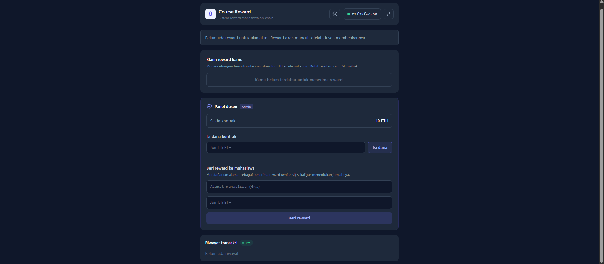
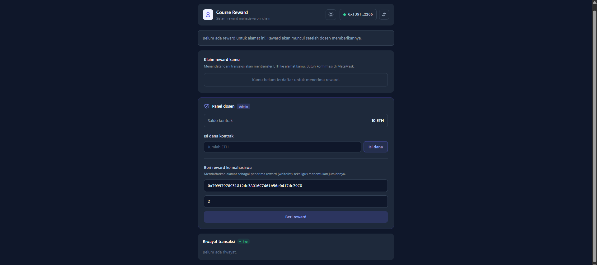
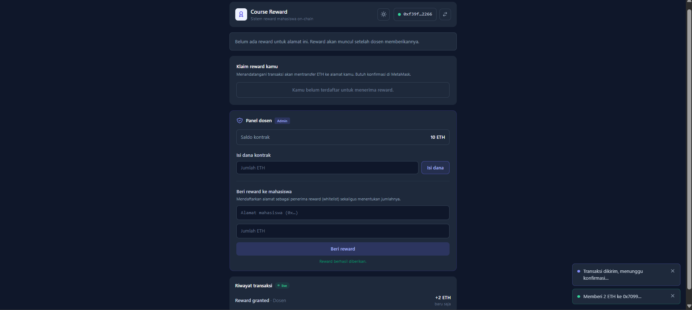
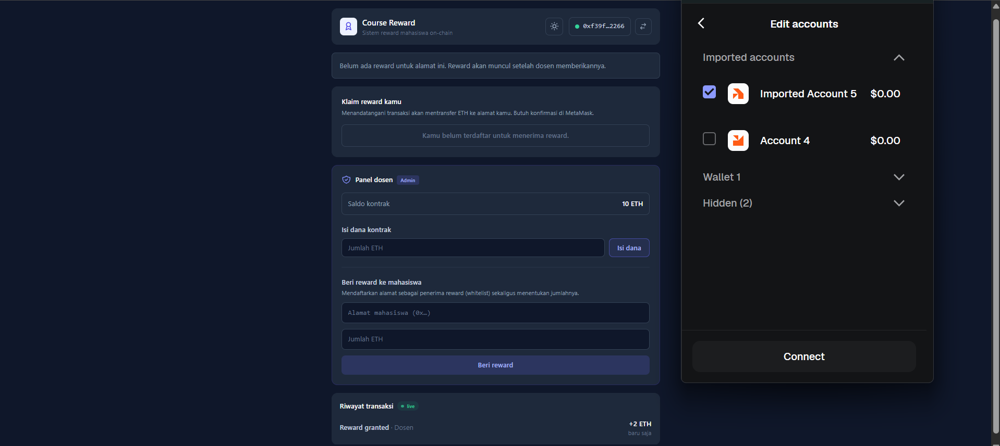
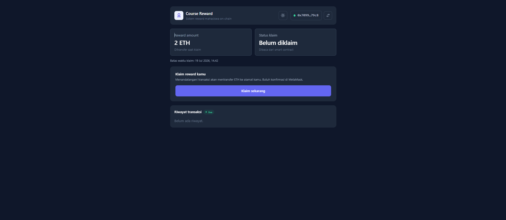

# Course Reward dApp

Aplikasi web (dApp) untuk sistem reward mahasiswa berbasis blockchain. Mahasiswa dapat menghubungkan wallet MetaMask, melihat jumlah reward, dan melakukan klaim. Dosen dapat memberikan reward ke alamat mahasiswa melalui panel admin.

## Anggota Kelompok

| NRP        | Nama                    | Kontribusi     |
| ---------- | ----------------------- | -------------- |
| 5002221162 | Brigitta Lucia Orina H  | Smart Contract |
| 5025221100 | Riyanda C Sinambela     | Frontend UI/UX |
| 5027231023 | Muhammad Faqih Husain   | Integrasi Web3 |

## Tech Stack

- Frontend: React + Vite
- Smart Contract: Solidity + Hardhat
- Web3 Library: ethers.js
- Wallet: MetaMask
- Styling: Tailwind CSS

## Fitur

- [x] Connect Wallet (MetaMask)
- [x] Lihat reward amount (read)
- [x] Lihat status klaim (read)
- [x] Claim reward (write)
- [x] Grant reward via panel dosen (write)
- [x] Notifikasi real-time & Toast
- [x] Riwayat transaksi (live)
- [x] Dark Mode (Bonus)
- [x] Loading Skeleton (Bonus)

## Cara Menjalankan

### Prerequisites

- Node.js v18+
- MetaMask browser extension
- Git

### 1. Clone Repository

```bash
git clone https://github.com/azoraichiga/blockchainFP
cd blockchainFP
```

### 2. Install Dependencies

```bash
npm install

cd frontend
npm install
```

### 3. Jalankan Local Blockchain

```bash
npx hardhat node
```

### 4. Deploy Smart Contract

```bash
# Di terminal baru
npx hardhat run scripts/deploy.js --network localhost
```

### 5. Update Contract Address

Salin address dari output deploy, lalu tempel ke `frontend/src/utils/contract.js`.

### 6. Import Account ke MetaMask

Salin private key dari output Hardhat node, import ke MetaMask. Pastikan network MetaMask diarahkan ke **Localhost 8545** dengan **Chain ID 1337**.

### 7. Jalankan Frontend

```bash
cd frontend
npm run dev
```

### 8. Buka Browser

http://localhost:5173

## Contract Address

- Local: `0x2279B7A0a67DB372996a5FaB50D91eAA73d2eBe6`
- Testnet (opsional): *(Belum di-deploy)*

## Demo

<!-- Link video demo  -->

## Screenshot

**1. Tampilan Awal Panel Dosen (Admin)**


**2. Dosen Memberikan Reward**


**3. Proses Ganti Akun di MetaMask**


**4. Mahasiswa Siap Mengklaim Reward**


**5. Mahasiswa Telah Mengklaim Reward**

